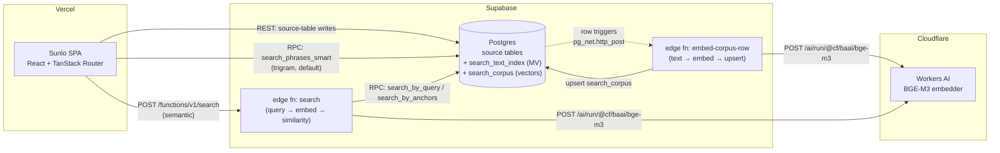

# Sunlo.app

A react SPA and a Supabase project.

## Local Setup

**tl;dr:** Install docker desktop, the Supabase CLI, and PNPM packages (`pnpm i`), run the Supabase DB start (or reset) (`supabase start` or `supabase db reset`) and run the vite server (`pnpm dev`).

### Supabase back-end

- Install [Docker Desktop](https://docs.docker.com/desktop/)
- Install [Supabase cli](https://supabase.com/docs/guides/local-development/cli/getting-started)
- `supabase start` to set up the Supabase project for the first time
- `supabase db reset` to run migrations and seeds

### React front-end

- `pnpm install`
- `cp .env.example .env`
- populate the environment variables in .env with the outputs from `supabase start`
- `pnpm dev`

Access the in the browser at `http://127.0.0.1:5173`.

## Database management

[Full list of Supabase CLI commands is here.](https://supabase.com/docs/reference/cli/supabase-status)

### Migrations

1. Use the local admin at [http://localhost://54323](http://localhost://54323) to make changes to your dev DB. You can point and click to add or modify columns, or use the SQL terminal to create or modify views and functions.
2. One your feature is working, use `pnpm run migrate` to create migrations based on your local changes.
3. `pnpm run seeds:schema` to re-create the base.sql schema. Be sure to use a formatter and only commit things you're sure of. (Oftentimes `base.sql` will be created with some key lines removed, like the command that turns on realtime for required tables (because your local doesn't have it turned on), so you have to not commit those deletions.)
4. `pnpm run types` to regenerate typescript types

The migrations should run when the main branch deploys. Or you can `supabase db push` to make it so.

[Read more about working with Supabase migrations.](https://supabase.com/docs/guides/local-development/cli/getting-started)

### To Modify the Seeds

We have a script capped `dump-new-seeds.ts` which is useful for taking local database state and turning it into seeds, specifically for this app.

- run the seeds with `supabase db reset`
- then modify data in the app and run ``

### Search corpus

See [Search architecture](#search-architecture) below for how the corpus is
populated, the modes that short-circuit it, and the backfill script.

## Search architecture

Search runs on **two parallel indexes** with very different cost shapes —
a fast lexical one (trigram) and a slow semantic one (vector embeddings).
Both are kept current as users edit phrases, translations, requests, and
playlists; both live in Postgres. The semantic side is the only thing that
talks to a third party.

### Components



Hosting split: Vercel serves the SPA, Cloudflare hosts the embedding model,
Supabase owns everything else (Postgres, RPCs, edge functions, auth). All
the moving parts live inside Supabase — that's where the architectural
weight is.

### The two indexes

|                  | Trigram (lexical)                                                                                                            | Embedding (semantic)                                                                                                                                                                            |
| ---------------- | ---------------------------------------------------------------------------------------------------------------------------- | ----------------------------------------------------------------------------------------------------------------------------------------------------------------------------------------------- |
| **Storage**      | `search_text_index` materialized view                                                                                        | `search_corpus` table with `vector(1024)` column                                                                                                                                                |
| **Populated by** | Statement-level triggers on each source table run `refresh materialized view concurrently search_text_index` in the same txn | Row-level triggers on each source table fire `pg_net.http_post` to the `embed-corpus-row` edge function, which calls Workers AI and upserts the result with `vectorized_at = source.updated_at` |
| **Latency**      | Synchronous — always consistent the moment the source write returns                                                          | Async — embeddings lag source writes by hundreds of ms typically; a `BEFORE UPDATE` guard on `search_corpus` drops out-of-order completions at the row level                                    |
| **Cost**         | Free (pure SQL)                                                                                                              | One Workers AI call per source-row write                                                                                                                                                        |
| **Used by**      | `search_by_trigram` RPC, `useSmartSearch` hook (in-app search bar)                                                           | `search` edge function (also serves as a deterministic embedding cache via `getOrEmbed` — exact-match queries skip Workers AI)                                                                  |

### Write path (when a phrase changes)

1. SPA writes to a source table (`phrase`, `phrase_translation`,
   `phrase_request`, `phrase_playlist`, `phrase_tag`) via PostgREST.
2. **Trigram side, in-transaction**: a per-statement trigger refreshes
   `search_text_index`. Done before the write returns.
3. **Embedding side, async**: a per-row trigger forwards the user's
   `Authorization` header into `pg_net.http_post` and returns. The edge
   function authenticates as that user, reads the source via
   `phrase_meta`, calls Workers AI, and upserts `search_corpus`. If the
   source is archived/deleted the edge function takes the cheap delete
   branch and skips Workers AI entirely.

Direct admin edits via Supabase Studio fire the trigger but have no
PostgREST session, so the dispatch is skipped — the corpus stays stale
until the next app-driven edit or a backfill run.

### Query path

- **In-app search bar (default)**: SPA → `search_phrases_smart` RPC →
  `search_by_trigram` over the materialized view. No edge function, no
  third party, no cost.
- **`/search` and `/chats` semantic search**: SPA → `search` edge
  function → Workers AI to embed the query → `search_by_query` RPC
  (cosine over `search_corpus.embedding`) → results hydrated and
  returned.

### Modes

| Mode                             | Trigger                                            | Trigram | Semantic search                                                                                                                                                                | Embed-on-write                                                                                                                                 |
| -------------------------------- | -------------------------------------------------- | ------- | ------------------------------------------------------------------------------------------------------------------------------------------------------------------------------ | ---------------------------------------------------------------------------------------------------------------------------------------------- |
| **Production**                   | default                                            | live    | live                                                                                                                                                                           | live (row triggers fire on every write)                                                                                                        |
| **Local with Cloudflare**        | local Supabase + keys in `supabase/functions/.env` | live    | live against local Supabase                                                                                                                                                    | live                                                                                                                                           |
| **Local without Cloudflare**     | local Supabase, no Workers AI keys                 | live    | trigram-anchor fallback: top trigram hits feed into `search_by_anchors` over the seeded corpus vectors; exact-text queries still hit the corpus-vector cache and skip the call | trigger fires, edge fn no-ops on inserts/updates (delete cleanup still runs); new rows are trigram-only until a backfill catches the corpus up |
| **Mock chat** (`pnpm dev:local`) | sets `VITE_CHAT_USE_MOCK=true`                     | live    | `/chats` UI uses canned data; `/search` works against whichever of the above modes the edge function is in                                                                     | n/a (no source writes happen on this path)                                                                                                     |

The trigram-anchor fallback runs whenever the `search` edge function
boots without `CLOUDFLARE_ACCOUNT_ID` + `CLOUDFLARE_API_TOKEN`. It also
doubles as a first-party-only deployment mode: ship the seed corpus, run
without Workers AI, and `/search` still returns plausible-shaped results
without any third-party dependency. The catch is that it's not really
semantic — it's "trigram → expand by neighbors of that row" — so for
ambiguous queries it clusters around whichever sense the trigram
matched. Acceptable in dev and in first-party-only production; unwanted
in the main production path where Workers AI is configured.

### Backfilling the corpus

`supabase db reset` wipes `search_corpus`. Repopulate with:

```bash
pnpm tsx scripts/backfill-search-corpus.ts
```

This calls Workers AI directly (requires `CLOUDFLARE_ACCOUNT_ID` and
`CLOUDFLARE_API_TOKEN` in `.env`) and writes vectors straight to
`search_corpus` — it doesn't go through the edge function. Takes ~30s on
seed-sized data. With `--skip-existing` it compares
`corpus.vectorized_at` against `source.updated_at` and re-embeds only
new or stale rows, so it's cheap to re-run after partial syncs.

See [`scripts/README.md`](./scripts/README.md) for the full flag list,
running against a remote project, and the cost shape.

## The React App

- This app is a full SPA as an architectural choice so that we can use Tauri to compile it to
  native apps.
-     We use Tanstack's Router in a React app bundled by Vite, as the front end framework.
- Data is fetched from the Supabase API using Tanstack DB's QueryCollections, loading up
  whole tables and slices of tables into the local Collections in memory, and then using
  live queries to combine, select, join, filter, and aggregate the data as the UI requies.
- Mostly when we mutate data we are using Tanstack Query's useMutation, and in the onSuccess for
  the mutation we will run an update to the local collection after the response data comes back:

```typescript
onSuccess: (data) => {
	someCollection.utils.writeInsert(SomeSchema.parse(data))
	toast.success('New deck created!')
}
```

- Realtime connections are used for friend requests and chat messages. They are quite easy to set
  up these listeners in a useEffect, to receive updates and then either `utils.writeInsert` or
  `utils.writeUpdate` the new record. It remains to be seen how they affect performance when the
  system has more users, so be mindful.

## Deployment

The app is deployed to **Vercel**.

### Vercel-Specific Features

**Social Previews (Open Graph):** The app uses
[Vercel Edge Middleware](https://vercel.com/docs/functions/edge-middleware)
(`middleware.ts`) to serve Open Graph meta tags to social media crawlers. Since the app is
a pure SPA with no SSR, this middleware intercepts crawler requests and returns a minimal
HTML page with OG tags for link previews on Facebook, Twitter, LinkedIn, WhatsApp, etc.

This feature **only works on Vercel** - if you deploy elsewhere, social link previews will
not work without implementing an equivalent solution for your platform.

## Using Tauri for Native Apps

It has always been our intention to cross-compile the JS app for use in a Tauri shell to make
native versions of the app, but at this time we aren't maintaining or supporting the Tauri build.

The technology and its industry support are improving rapidly so by the time we are finished with
some other core features, it will make sense to come back and take another try at it.
