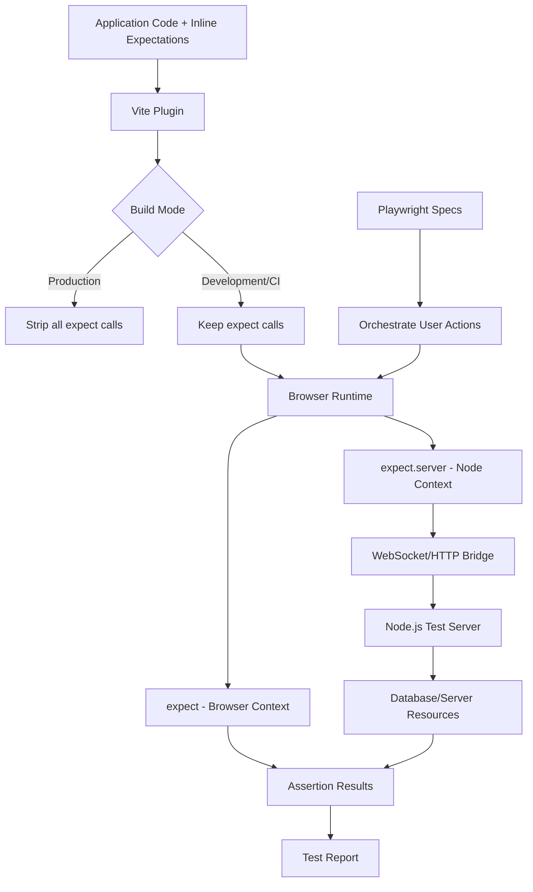

# Inline Testing Framework Design

## Overview

A novel testing approach that inverts the traditional testing model by embedding test assertions
directly within application code, allowing E2E tests to leverage actual application logic rather
than recreating it in separate test files.

This is entirely inspired by Playwright's `page.evaluate(fn, data)` which allows us to pass data
from NodeJS into a test that will run in the browser. I just wanted to do it in the reverse order.

## Core Concept

Traditional E2E testing requires recreating application logic in test files. This framework proposes:

1. **Write expectations inline** with application code
2. **Dual-context assertions** - browser AND Node.js server checks
3. **Conditional compilation** via Vite plugin removes them in production
4. **Orchestration-based activation** - external specs act as "scripts" triggering inline expectations

## Problems This Solves

### Traditional Testing Pain Points

```typescript
// ❌ Traditional approach - logic duplication
// In test file:
test('create post', async ({ page }) => {
	await page.fill('[name="title"]', 'My Post')
	await page.fill('[name="content"]', 'Content here')
	await page.click('button[type="submit"]')

	// Recreating validation logic that already exists in app
	await expect(page.locator('.success-message')).toBeVisible()

	// Separate DB check
	const post = await db.post.findFirst({ where: { title: 'My Post' } })
	expect(post).toBeTruthy()
})
```

### Inline Testing Approach

```typescript
// ✅ Inline approach - use actual application logic
// In application code:
async function handleCreatePost(data: PostData) {
	const result = await api.posts.create(data)

	// Expectations embedded in application flow
	expect(result.success).toBe(true)
	expect(result.post.title).toBe(data.title)

	// Server-side check runs in Node.js context (non-blocking)
	// Enqueued and validated by test runner
	expect.server(async (data) => {
		const dbPost = await server.db.posts.findFirst({
			where: { id: data.id },
		})
		expect(dbPost.title).toBe(data.title)
		expect(dbPost.status).toBe('published')
	}, result.post)

	return result
}
```

## Architecture

### Component Overview



### Components

#### 1. Vite Plugin (`vite-plugin-inline-test`)

**Responsibilities:**

- Parse and detect `expect()` and `expect.server()` calls
- Conditionally remove them based on build mode
- Inject runtime helpers in dev/test mode

```typescript
// vite.config.ts
import { inlineTest } from 'vite-plugin-inline-test'

export default {
	plugins: [
		inlineTest({
			// Strip in production, keep in dev/ci
			enabled: process.env.NODE_ENV !== 'production',
			// Or more granular control
			modes: ['development', 'test'],
			// Custom import source
			importSource: '@/testing/expect',
		}),
	],
}
```

#### 2. Browser Runtime (`@inline-test/runtime`)

**Responsibilities:**

- Provide `expect()` API in browser context
- Enqueue `expect.server()` calls to Node.js server (non-blocking)
- Collect and report assertion results

```typescript
// Auto-injected in browser context when enabled
declare global {
	function expect<T>(actual: T): Matchers<T>

	namespace expect {
		// Server checks are non-blocking - enqueued and collected by test runner
		function server<T>(fn: (data: T) => Promise<void>, data: T): void
	}

	// Server utilities available globally in expect.server() context
	// This runs with elevated privileges (service role)
	const server: {
		db: PrismaClient | SupabaseClient
		ctx: {
			userId?: string
			sessionId?: string
			// Any context from browser
		}
		// Custom providers from config
		[key: string]: any
	}
}
```

#### 3. Test Server (`@inline-test/server`)

**Responsibilities:**

- Run Node.js checks from browser
- Provide database/server access
- Manage test isolation

```typescript
// Run alongside dev server
import { createTestServer } from '@inline-test/server'

const server = createTestServer({
	port: 3001,
	db: () =>
		createSupabaseClient({
			url: process.env.SUPABASE_URL,
			key: process.env.SUPABASE_SERVICE_ROLE_KEY,
		}),
})
```

#### 4. Playwright Integration

**Responsibilities:**

- Orchestrate user flows
- Trigger inline expectations
- Collect results

```typescript
// e2e/posts.spec.ts
import { test } from '@inline-test/playwright'

test('create post flow', async ({ page, inlineTest }) => {
	await page.goto('/posts/new')
	await page.fill('[name="title"]', 'My Post')
	await page.fill('[name="content"]', 'Great content')
	await page.click('button[type="submit"]')

	// Wait for inline expectations to complete
	await inlineTest.waitForAssertions()

	// All inline expects have already validated!
	// This test just orchestrates the flow
})
```

## Detailed Examples

### Example 1: Simple Form Submission

```typescript
// src/components/PostForm.tsx
import { expect } from '@inline-test/runtime'

export function PostForm() {
  const handleSubmit = async (data: PostFormData) => {
    const result = await createPost(data)

    // Inline expectations
    expect(result.success).toBe(true)
    expect(result.post).toBeDefined()
    expect(result.post.title).toBe(data.title)

    // Server-side validation (non-blocking)
    expect.server(async (data) => {
      const post = await server.db
        .from('posts')
        .select()
        .eq('id', data.id)
        .single()

      expect(post.data.title).toBe(data.title)
      expect(post.data.author_id).toBe(server.ctx.userId)
    }, result.post)

    navigate(`/posts/${result.post.id}`)
  }

  return <form onSubmit={handleSubmit}>...</form>
}
```

```typescript
// e2e/posts.spec.ts - Just orchestration!
test('create post', async ({ page }) => {
	await login(page)
	await page.goto('/posts/new')
	await page.fill('[name="title"]', 'Test Post')
	await page.click('button[type="submit"]')

	// That's it! Inline expects already validated everything
	await expect(page).toHaveURL(/\/posts\/\d+/)
})
```

### Example 2: Complex Multi-Step Flow

```typescript
// src/features/onboarding/steps/ProfileStep.tsx
export function ProfileStep() {
  const handleComplete = async (profile: ProfileData) => {
    const result = await updateProfile(profile)

    expect(result.success).toBe(true)

    expect.server(async (data) => {
      const user = await server.db
        .from('users')
        .select('*, profile(*)')
        .eq('id', server.ctx.userId)
        .single()

      expect(user.data.profile.bio).toBe(data.bio)
      expect(user.data.profile.avatar_url).toBeTruthy()
      expect(user.data.onboarding_completed).toBe(true)
    }, profile)

    onNext()
  }

  return <ProfileForm onSubmit={handleComplete} />
}
```

```typescript
// e2e/onboarding.spec.ts
test('complete onboarding', async ({ page }) => {
	await signup(page)

	// Step 1: Profile
	await page.fill('[name="bio"]', 'Software engineer')
	await page.setInputFiles('[name="avatar"]', './fixtures/avatar.jpg')
	await page.click('button:text("Next")')

	// Step 2: Preferences
	await page.click('[data-theme="dark"]')
	await page.click('button:text("Complete")')

	// All inline expects validated each step!
	await expect(page).toHaveURL('/dashboard')
})
```

### Example 3: Real-time Updates

```typescript
// src/features/chat/MessageList.tsx
export function MessageList() {
  const handleSendMessage = async (text: string) => {
    const message = await sendMessage(text)

    expect(message.id).toBeDefined()
    expect(message.content).toBe(text)

    // Verify message was broadcast to other users (non-blocking)
    expect.server(async (data) => {
      const dbMessage = await server.db
        .from('messages')
        .select('*, recipients(*)')
        .eq('id', data.id)
        .single()

      expect(dbMessage.data.recipients.length).toBeGreaterThan(0)

      // Check realtime event was triggered
      const realtimeEvents = await server.getRealtimeEvents({
        channel: `room:${data.room_id}`,
        since: Date.now() - 1000
      })

      expect(realtimeEvents).toContainEqual({
        event: 'message:new',
        payload: expect.objectContaining({ id: data.id })
      })
    }, message)
  }

  return <ChatInput onSend={handleSendMessage} />
}
```

### Example 4: Conditional Expectations

```typescript
// src/features/posts/EditPost.tsx
export function EditPost() {
  const handleUpdate = async (data: PostData) => {
    const result = await updatePost(postId, data)

    expect(result.success).toBe(true)

    // Only check if published
    if (data.status === 'published') {
      expect.server(async (post) => {
        // Verify search index was updated
        const searchResults = await server.search.query(post.title)
        expect(searchResults.some(r => r.id === post.id)).toBe(true)

        // Verify notifications were sent to followers
        const notifications = await server.db
          .from('notifications')
          .select()
          .eq('post_id', post.id)
          .eq('type', 'post_published')

        expect(notifications.data.length).toBeGreaterThan(0)
      }, result.post)
    }

    navigate(`/posts/${postId}`)
  }

  return <PostEditor onSubmit={handleUpdate} />
}
```

## Implementation Plan

### Phase 1: Core Runtime

- [ ] Create `@inline-test/runtime` package
- [ ] Implement browser `expect()` API (subset of Jest/Vitest matchers)
- [ ] Create WebSocket bridge for `expect.check()`
- [ ] Build result collection and reporting

### Phase 2: Vite Plugin

- [ ] Parse and detect `expect()` calls via AST traversal
- [ ] Implement conditional stripping based on mode
- [ ] Handle TypeScript types injection
- [ ] Support source maps

### Phase 3: Test Server

- [ ] Create `@inline-test/server` package
- [ ] WebSocket server for browser-to-node bridge
- [ ] Context injection (userId, session, etc.)
- [ ] Database client management
- [ ] Test isolation and cleanup

### Phase 4: Playwright Integration

- [ ] Create `@inline-test/playwright` package
- [ ] Custom test fixtures
- [ ] Assertion collection and waiting
- [ ] Error reporting integration
- [ ] Screenshot/trace on assertion failure

### Phase 5: Developer Experience

- [ ] VS Code extension for syntax highlighting
- [ ] ESLint plugin for best practices
- [ ] TypeScript language service plugin
- [ ] Documentation and examples

## Configuration API

```typescript
// inline-test.config.ts
import { defineConfig } from '@inline-test/config'

export default defineConfig({
	vite: {
		enabled: process.env.NODE_ENV !== 'production',
		importSource: '@inline-test/runtime',
	},

	server: {
		port: 3001,
		database: async () => {
			return createClient({
				url: process.env.SUPABASE_URL!,
				key: process.env.SUPABASE_SERVICE_ROLE_KEY!,
			})
		},

		// Custom server utilities
		providers: {
			search: () => createSearchClient(),
			email: () => createEmailClient({ mock: true }),
		},
	},

	playwright: {
		// Auto-wait for inline assertions
		autoWait: true,
		// Fail test if inline assertion fails
		failOnAssertionError: true,
		// Collect traces on assertion failures
		traceOnFailure: true,
	},
})
```

## Benefits

1. **No Logic Duplication** - Tests use actual app code
2. **Co-location** - Expectations live with the code they validate
3. **Simpler Specs** - Spec files act as "scripts" to follow
4. **Type Safety** - Full TypeScript support in both contexts
5. **Comprehensive Coverage** - Easy to add assertions as you code
6. **Better Debugging** - Failures pinpoint exact app code location
7. **Faster Iteration** - Change logic once, not in app + tests

## Considerations

### Potential Drawbacks

1. **Bundle Size in Dev** - Runtime overhead in development builds
2. **Test Isolation** - Need careful context management
3. **Learning Curve** - Novel paradigm for developers
4. **IDE Support** - May need custom tooling for best DX

### Mitigation Strategies

1. Use lazy imports and code splitting for runtime
2. Implement robust cleanup between test runs
3. Provide migration guide from traditional testing
4. Build VS Code extension early

## Next Steps

1. **Prototype** the core runtime and bridge
2. **Validate** with a few real-world flows in your app
3. **Iterate** on DX and API design
4. **Extract** into standalone packages if successful
5. **Open source** to gather community feedback

---

## Questions to Explore

- Should `expect()` calls be synchronous or async by default?
- How to handle expectations in loops or conditional branches?
- Should we support snapshot testing inline?
- How to handle test data cleanup after server checks?
- Should we provide a way to disable specific inline expects?
- How to handle expectations in error boundaries?

## Inspiration & Related Work

- **Playwright** - Cross-context testing, (`page.evaluate(fn, data)`)
- **Vitest In-Source Testing** - Conditional test compilation
- **Storybook Play Functions** - Inline interaction testing
- **Inline Snapshots** - Jest/Vitest inline snapshot support
- **Power Assert** - Enhanced assertion messages
- **Contract Testing** - Pact, Spring Cloud Contract
